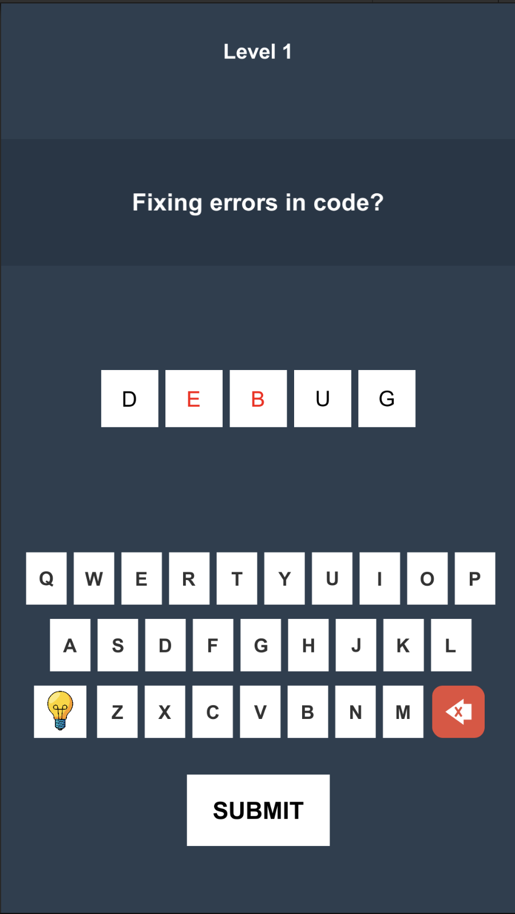

# Unity Word Game

A lightweight word‑guessing game built with **Unity**.  
Designed as a clean, readable project to demonstrate coding style, UI workflow, ScriptableObjects, and general Unity architecture.

## 🎮 Play the Web Demo
👉 **https://bahadirkus.github.io/Unity-WordGame/**

---

## 📌 Features
- Custom on‑screen keyboard system  
- Answer slot system  
- Hint mechanic  
- Level data handled with ScriptableObjects  
- Clean and modular C# architecture  
- Mobile‑friendly UI layout  
- WebGL build ready for GitHub Pages  

---

## 🧩 Project Structure
```
Assets/
 ├─ Scripts/
 │   ├─ WordGameController.cs
 │   ├─ KeyboardLetter.cs
 │   ├─ AnswerSlot.cs
 │   ├─ AudioManager.cs
 │   ├─ SaveManager.cs
 │   └─ LevelDataScriptable.cs
 ├─ Prefabs/
 ├─ UI/
 └─ Levels/
```

## Screenshot



---

## 🚀 Technologies Used
- **Unity 2021+**
- **C#**
- **ScriptableObjects**
- **Unity UI (uGUI)**
- **WebGL**

---

## 📱 Mobile Note
This project was originally designed for mobile.  
UI elements scale automatically on desktop but will appear spaced out because of the large aspect ratio.  
This is normal and not a bug.

---

## 👤 Author
**Bahadır Kuş**  
Simulation Developer & Unity Developer  
GitHub: https://github.com/Bahadirkus
